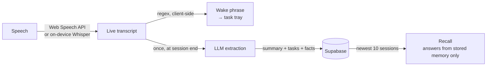

# Second Coworker

**Your AI teammate that remembers every meeting, captures tasks in real time, and recalls past context exactly when you need it.**

Meeting tools give you a transcript. Nobody reads the transcript. Second Coworker
throws the prose away and keeps the *structure* — the decisions, the commitments,
the constraints — so that three weeks later, "what did we decide about pricing?"
has an answer instead of a search result.

Working prototype. The full loop runs end to end. Built for **iQOO Hackathon 2026**.

---

## The problem

Every meeting produces decisions. Almost none of them survive.

The current answer is transcription: Fireflies, Granola, Fathom, Otter, Limitless
all record the room and hand back a wall of text with a summary stapled to the
top. That's a better filing cabinet, not a better memory. The information is
technically present and practically unreachable — you'd have to know which
meeting to open before you can find what you forgot.

So the question that actually matters is never *"what was said?"* It's
**"what did we decide, and why?"** — asked weeks later, by someone who doesn't
remember which meeting to look in.

## The bet

**Store memory objects, not transcripts.**

When a session ends, one model call extracts the transcript into a fixed set of
categories — `Task`, `Decision`, `Preference`, `Requirement`, `Fact`,
`Action Item` — and those objects are what get persisted. Recall then answers
from the structured objects, never by re-reading raw text.

|  | Transcript tools | Second Coworker |
|---|---|---|
| What's stored | Raw text + a summary | Typed memory objects |
| Retrieval | Search the meeting you already remembered | Ask a question across all meetings |
| Answer to "why did we drop X?" | A timestamp to go read | The decision, with its source session |
| Grows more useful over time | Archive grows | Memory grows |

The categories are deliberately fixed and small. An open-ended "extract what
seems important" prompt collapses back into summarization — which is the thing
that already doesn't work.

## How it works



1. **Start a session.** Speech renders live in the browser — no server round-trip.
2. **Say a wake phrase.** *"Hey Coworker, remind me to send the deck"* → the task
   appears in the tray instantly. This is a regex on the transcript stream, not a
   second model running continuously.
3. **End the session.** The transcript goes to the LLM **once** and comes back as
   strict JSON: `{summary, tasks, facts}`.
4. **Ask later.** *"What did I decide in yesterday's meeting?"* → the backend
   retrieves past sessions by recency and the model answers **only** from that
   retrieved context. If the answer isn't there, it says so instead of guessing.

Two design choices worth calling out, because they're the ones people ask about:

- **Extraction runs once, at the end** — not every few seconds. Continuous
  extraction burns tokens to produce worse structure, because the model can't see
  where the conversation landed until it lands.
- **Retrieval is by recency, not embeddings.** At the scale where a memory layer
  has to *earn* trust, a vector index adds a failure mode (silently retrieving
  the wrong thing) without adding an answer. It's a roadmap item, not a v1.

## What's actually built

Honest status, because a demo that overclaims is worse than a small one that doesn't.

| | |
|---|---|
| Live transcription | ✅ Verified (Chrome/Edge, Web Speech API) |
| Wake-phrase → task tray | ✅ Verified, handles phrases split across pauses |
| End-of-session extraction | ✅ Verified against live Gemini |
| Supabase persistence | ✅ Verified |
| Cross-session recall | ✅ Verified, including date-relative questions |
| Installable on a phone (PWA) | ✅ Builds a real WebAPK |
| On-device Whisper | ⚠️ VAD + model init confirmed in-browser; generate call fixed and verified in Node — awaiting one real-speech run |
| Auth / multi-user | ❌ Out of scope — single-user prototype, RLS off |
| Fully on-device LLM | ❌ Roadmap (see below) |

## Stack

| Layer | Choice | Why |
|---|---|---|
| Frontend | React + Vite | Four screens, state-based switching — no router needed |
| Transcription | Web Speech API | Browser-native, zero latency, zero infra |
| Backend | FastAPI | Five routes; `/docs` gives a live API explorer |
| AI | `gemini-3.6-flash`, `temperature: 0` | Structured output via `response_schema` enforces the JSON contract |
| Database | Supabase | Postgres without running Postgres |

The provider is chosen at runtime by which key is in `.env` (`GEMINI_API_KEY` vs
`OPENAI_API_KEY`), and the prompts live in [`prompts/`](prompts/) as files rather
than string literals — so swapping models is a one-file change and the
`{summary, tasks, facts}` contract holds either way.

Temperature is pinned to `0` everywhere. A demo that answers differently on the
second run isn't a demo.

```
backend/     FastAPI app, Supabase client, LLM calls, demo seeder
frontend/    React + Vite, four screens, PWA manifest
database/    schema.sql
prompts/     extraction + recall prompts
```

---

## Quickstart

Requires **Node 18+**, **Python 3.11+**, and a Chromium browser (Chrome or Edge —
the Web Speech API doesn't exist in Firefox or Safari).

**1. Backend**

```bash
cd backend
python -m venv venv
venv\Scripts\activate          # Windows
# source venv/bin/activate     # macOS/Linux
pip install -r requirements.txt
```

Copy `.env.example` to `.env`:

| Variable | Where to get it |
|---|---|
| `SUPABASE_URL` | Supabase → Project Settings → API → Project URL |
| `SUPABASE_KEY` | same page → `anon` `public` key |
| `GEMINI_API_KEY` | [aistudio.google.com/apikey](https://aistudio.google.com/apikey) (free tier) |

Set **only one** AI key — the backend refuses to run a call if both are present.

**2. Database**

Run [`database/schema.sql`](database/schema.sql) in the Supabase SQL editor.
It's idempotent. RLS is intentionally off: there's no auth in this prototype, and
enabling it without policies denies every insert.

**3. Frontend**

```bash
cd frontend && npm install
```

**4. Run** — two terminals:

```bash
cd backend && venv\Scripts\activate && uvicorn main:app --reload
cd frontend && npm run dev
```

Open **http://localhost:5175** in Chrome and accept the microphone prompt.
The backend is reached through Vite's `/api` proxy, so you don't open port 8000
directly.

**Before a demo,** seed a backdated session so "yesterday" has something real to
find — otherwise every session is timestamped today and the answer is vague:

```bash
cd backend && python seed_demo.py --reset
```

---

## Running it on a phone

The app is a PWA — the phone runs the same code the laptop does. Two constraints
come from the browser, not from us:

- **It must be HTTPS.** `getUserMedia` and the Web Speech API are restricted to
  secure contexts, so `http://192.168.x.x:5175` over the LAN is refused. Only
  `localhost` is exempt, and on the phone `localhost` is the phone.
- **The API must be same-origin.** Hence `/api` + the Vite proxy: one tunnel
  covers both servers, and an HTTPS page never calls a plain-HTTP backend.

**1. Start both servers** as above.

**2. Expose the frontend.** `cloudflared` gives a throwaway HTTPS URL, no account:

```bash
winget install --id Cloudflare.cloudflared
cloudflared tunnel --url http://127.0.0.1:5175
```

Tunnel hostnames are already in `server.allowedHosts` — without that, Vite 5.4.12+
answers every tunnel request with *"Blocked request"*. Only tunnel the frontend;
the backend goes through the proxy.

**3. Install it.** Open the tunnel URL in Chrome on the phone →
**⋮ → Add to Home Screen**. It must say **Install**, not *"Add shortcut"* — a
shortcut is just a tab, and Android can't float a tab.

**4. Float it.** Installing produces a WebAPK, a real installed Android app, which
Funtouch OS / OriginOS's multi-window sidebar can pick up: swipe in from a bottom
corner and drag **Coworker** out as a floating window. *(Untested on the target
device; split-screen from Recents is the fallback.)*

**5. Record** with the Quick Settings screen recorder — but see the mic note below.

## Transcription engines

Home has an engine picker:

- **Cloud (Web Speech)** — the default and the verified path. Word-by-word and
  near-instant, but sends audio to Google and needs a network.
- **On-device (Whisper)** — Silero VAD segments speech, Whisper transcribes each
  utterance in a worker. Nothing leaves the device; ~2s after each pause, no
  interim text. First run downloads ~152MB.

  **Status:** Silero VAD, the onnxruntime wasm and Whisper's model init are all
  confirmed working in the browser. The last step was blocked by a bad generate
  call — `language`/`task` passed to the English-only `tiny.en`, which throws
  unconditionally — now fixed and verified against the real model. It stays off
  by default until it's been run once on real speech.

`frontend/public/ort/` holds the onnxruntime wasm Whisper needs. It's
**gitignored** (~40MB, reproducible) and regenerated on `npm install` / `dev` /
`build` by `frontend/scripts/copy-ort-assets.mjs`. If Whisper reports *"no
available backend found"*, run that script.

## Gotchas worth knowing

Each of these cost us real hours.

**`uvicorn --reload` silently serves stale code.** The reloader spawns a child
worker; killing only the PID uvicorn printed leaves that worker orphaned and still
bound to the port, serving old code — and Windows keeps attributing the socket to
the dead parent, so it looks like a phantom listener. Kill by name:

```bash
taskkill /IM python3.11.exe /F   # note: python3.11.exe in this venv, not python.exe
```

**Android Chrome ignores `continuous`** and ends recognition after every
utterance. `useSpeechTranscript` restarts it on `end` with a short delay —
restarting synchronously races the teardown, throws `InvalidStateError`, and the
transcript dies after one sentence.

**Screen recorders can starve the mic.** Android generally grants the microphone
to one app at a time, so a screen recorder capturing mic audio can leave Chrome
with silence — video with your voice, transcript frozen. Test the audio source
before the real take.

**Web Speech captures your microphone only.** In a video call, other participants
come out of your speakers, not your mic. System audio needs WASAPI/CoreAudio,
which is a roadmap item.

**Gemini's free tier is 20 requests/day.** Every summary and every recall question
is one. Rehearse the speech parts with the AI steps skipped.

## Roadmap

Deliberately *not* built yet — the prototype is one complete loop, not many
incomplete features.

- **On-device SLM** (Gemma via llama.cpp) so extraction and recall run with no
  network and no API cost
- **Memory Graph** — link decisions to the requirements and people they touch
- **Contradiction detection** across meetings ("this reverses what you decided in March")
- **Desktop background agent** with system-audio capture (WASAPI/CoreAudio)
- **Pre-meeting briefing** — what you decided last time, before you walk in

## License

MIT — see [LICENSE](LICENSE).

---

<sub>[`CLAUDE.md`](CLAUDE.md) is the locked scope for this prototype and takes
precedence over this README.</sub>
