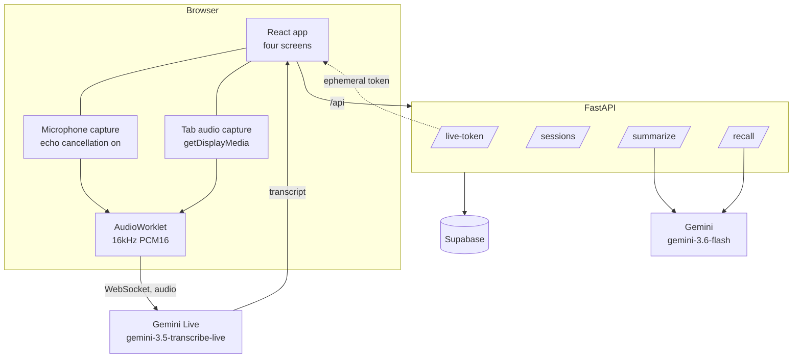

# System design

How Second Coworker actually works. The [README](../README.md) covers what it is
and how to run it; this covers how it's built and why it's built that way.

---

## 1. The shape of it

Three processes and two external services.



The browser talks to two different things: **our backend** for storage and
reasoning, and **Gemini Live directly** for audio. Audio never passes through
the backend — see §3.

Everything the frontend sends us goes to `/api/...` **same-origin**. In
development Vite proxies that to `localhost:8000`; in production Vercel rewrites
it to the deployed backend. The frontend never learns the backend's URL, so
there is no CORS configuration and no build-time API variable.

---

## 2. Two audio paths, kept apart

A call has two sources of speech, and they stay separate from capture all the way
to storage.

| | Microphone | Other participant |
|---|---|---|
| Captured by | `getUserMedia` | `getDisplayMedia({audio:true})` |
| Constraints | `echoCancellation`, `noiseSuppression`, `autoGainControl` | none available |
| Tagged | `you` | `them` |
| Feeds wake phrase | **yes** | no |
| Available on mobile | yes | **no** |

**Why not mix them into one stream.** Mixing is simpler and halves the number of
sessions, but it throws away who said what — and that information is free here,
because the two sources arrive as two streams. Keeping them apart gives speaker
attribution with no diarization model.

**Why the wake phrase only reads the microphone.** Two reasons. Practically,
`LiveSession` dedupes wake-phrase matches by character offset into the joined
transcript, which only works on one append-only stream — interleaving a second
speaker shifts offsets and re-fires old matches. Semantically, *"Hey Coworker"*
is an instruction from the user; the person on the other end of the call
shouldn't be able to put tasks in your tray.

**Why tab audio needs a video track.** Chrome won't offer "share tab audio"
without a video request, so we ask for video and stop the track immediately. The
most common failure isn't an exception — it's the user sharing without ticking
the audio box, which *succeeds* and returns a stream with zero audio tracks. We
detect that explicitly and say so.

---

## 3. Why audio bypasses our backend

Audio goes browser → Gemini directly, never through FastAPI.

Proxying would mean every 100ms chunk makes an extra network hop each way. That
turns sub-second transcription into something visibly laggy, and it would put a
sustained audio stream through a free-tier web service that sleeps when idle.

The cost of going direct is that the **browser needs a credential** — and it must
not be `GEMINI_API_KEY`. So `POST /live-token` mints an *ephemeral* token:
single-use, expires in minutes, scoped to one session. One token per socket, so
a leaked one buys almost nothing.

```
browser ──POST /api/live-token──► FastAPI ──► Gemini (mints token)
browser ◄─────── auth_tokens/… ──────────────────┘
browser ═══════ WebSocket + audio ═══════════════► Gemini Live
```

---

## 4. Echo, and why it needs two layers

On speakerphone the other participant's voice comes out of the speakers and back
into the microphone. Without handling, the same sentence is transcribed twice —
once as `them`, once as `you` — which corrupts both the transcript and the
attribution.

**Layer 1 — acoustic.** The microphone is captured with `echoCancellation: true`.
Browser AEC exists precisely to subtract audio the machine is playing out; it's
why Meet and Zoom are usable on speakerphone. *This is only available to us
because we capture the microphone ourselves* — the Web Speech API does its own
capture and exposes no constraints, which is the main reason it isn't the primary
engine any more.

**Layer 2 — textual.** AEC is imperfect at high volume or through an external
speaker. So before a `you` segment is appended, it's compared against `them`
segments from the last few seconds ([`echoDedupe.js`](../frontend/src/lib/echoDedupe.js)):
Dice similarity over word bigrams, plus a containment check for fragments.

Three properties make this safe:

- **Directional.** Only a `you` segment is ever discarded, only when it matches a
  `them` segment. The remote original is never touched. Worst case is a duplicate
  slipping through — never the other participant's words disappearing.
- **Bigrams, not word sets.** *"we ship on Friday"* and *"Friday we ship on"*
  share every word but are different utterances.
- **Minimum three words.** Both people genuinely say "yeah" and "right"
  constantly. Wrongly deleting the user's own short reply is worse than letting a
  short echo through.

---

## 5. Sessions expire; the transcript shouldn't

Gemini Live caps a session at about ten minutes. A naive stop-then-start drops
whatever is said in the gap.

The server warns before it closes, sending `goAway` with the time remaining, and
periodically issues `sessionResumption` handles. So
[`liveTranscriber.js`](../frontend/src/lib/liveTranscriber.js) reacts to the
server's own signal rather than a client-side timer — the server knows the real
deadline, and it moves.

```
   ── active socket ─────────────────┐
                    goAway ──► open replacement (with resumption handle)
                                     ├── both receive audio ──┐
   ── old closes after grace ────────┘                        └── replacement is active
```

Audio is fed to **both** sockets during the handover so the replacement doesn't
start mid-sentence, and the outgoing socket keeps emitting for a short grace
period so a sentence already in flight isn't truncated. Duplicates across the
seam are suppressed by the same overlap comparison used for echo — scoped to the
handover window, so genuine repetition in ordinary speech is untouched.

An unexpected close (network blip) is handled by the same path: reconnect using
the last resumption handle.

---

## 6. What happens during a session vs. after

This is the core architectural commitment, and it's deliberately conservative.

**During**, exactly two things run:

1. Continuous transcription of both audio streams.
2. Wake-phrase matching — a **regex** over the microphone transcript, not a model.

**After** the session ends, the transcript goes to the LLM **once**.

Continuous extraction — re-summarising every few seconds — would burn tokens to
produce *worse* structure, because a model can't tell you where a conversation
landed until it lands. It also makes battery and cost scale with meeting length
instead of with meeting count.

---

## 7. Request lifecycle

| Route | When | What it does |
|---|---|---|
| `POST /live-token` | Per WebSocket: twice at session start, once per reconnect | Mints a single-use ephemeral Gemini token |
| `POST /sessions` | End Session | Inserts the transcript; `summary` deliberately left null |
| `POST /sessions/{id}/tasks` | End Session | Inserts wake-phrase tasks, deduped case-insensitively |
| `POST /sessions/{id}/summarize` | Summary screen mounts | One LLM call → `{summary, tasks, facts}`, stored |
| `POST /recall` | Recall screen | Retrieves recent sessions, one LLM call answering from them alone |

Two details that aren't obvious:

**Extraction is triggered by the Summary screen mounting**, not by
`LiveSession`. `LiveSession`'s job ends at persisting raw material; interpreting
it is a different job with a different failure mode.

**Tasks are written by two independent paths** — the wake-phrase tray and the
model's extraction — and they overlap heavily, because a spoken *"remind me
to X"* is also obviously a Task to the model. `_insert_tasks` dedupes
case-insensitively against what's already stored, or every wake-phrase task would
appear twice.

---

## 8. Data model

```
sessions                          tasks
─────────────────────             ─────────────────────
id          uuid                  id          uuid
transcript  text    ◄── speaker   session_id  uuid → sessions.id
summary     text        labelled  text        text
facts       jsonb[]               timestamp   timestamptz
timestamp   timestamptz
```

`facts` is stored **separately from `summary`**, not folded into the prose. That
separation is the product bet: flattening decisions into a paragraph throws away
exactly the structure recall depends on.

Speaker labels live in the existing `transcript` text column as `You:` / `Them:`
lines — no schema change, and the extraction prompt reads them to attribute
commitments correctly.

**Known limitation:** the six memory categories (`Task`, `Decision`,
`Preference`, `Requirement`, `Fact`, `Action Item`) drive extraction, but `facts`
is a flat array of strings — the category survives in the wording
(*"Decided to launch in March"*) rather than as a queryable field. Typed columns
are a roadmap item.

---

## 9. Retrieval: recency, not embeddings

`/recall` pulls the **10 most recent sessions** by timestamp, reverses them into
chronological order, and passes their summaries and facts as context.

No vector search. At the scale where a memory layer still has to *earn* trust, an
embedding index adds a failure mode — silently retrieving the wrong meeting —
without adding an answer. Recency is predictable, debuggable, and explains
itself.

Two things make date questions work:

- **Today's date is injected into the prompt.** The model has no clock, so
  "yesterday" is meaningless without it.
- **Each session is rendered with its date**, so the model can attribute an
  answer to the meeting it came from.

If the answer isn't in the retrieved context, the prompt requires the model to
say so rather than guess. A confidently wrong recall is worse than an honest "I
don't know" — the entire product depends on this memory being trustworthy.

---

## 10. Failure modes and what happens

| Failure | Behaviour |
|---|---|
| Live engine can't start (quota, outage) | Falls back to Web Speech, microphone only, with the reason shown |
| User declines the tab share | Continues with microphone only — **not** a fallback, the live engine still runs |
| Tab shared without audio | Detected via zero audio tracks; tells the user to re-share with the audio box ticked |
| Live session hits its 10-minute cap | Overlapping handover, no gap (§5) |
| Socket drops unexpectedly | Reconnects with the last resumption handle |
| Nothing was transcribed | Session is **not** saved — an empty row can't be summarised and would still occupy a slot in recall's 10-session window |
| Session saves but tasks fail | Still proceeds to Summary; the saved session isn't lost over a secondary failure |
| Mobile browser | `getDisplayMedia` audio doesn't exist on Android; both-sides capture is desktop-only |

---

## 11. Provider seam

Prompts live in [`prompts/`](../prompts/) as files, not string literals, and
`ai.py` picks its provider from which key is present in `.env` — refusing to run
if both are. Swapping models is a one-file change and the
`{summary, tasks, facts}` contract holds either way.

Temperature is pinned to `0` everywhere. A system that answers differently on the
second run can't be trusted as a memory.

One consequence worth knowing: **prompts are read at import time**, and
`uvicorn --reload` only watches `backend/`, so editing a prompt requires a
restart.
